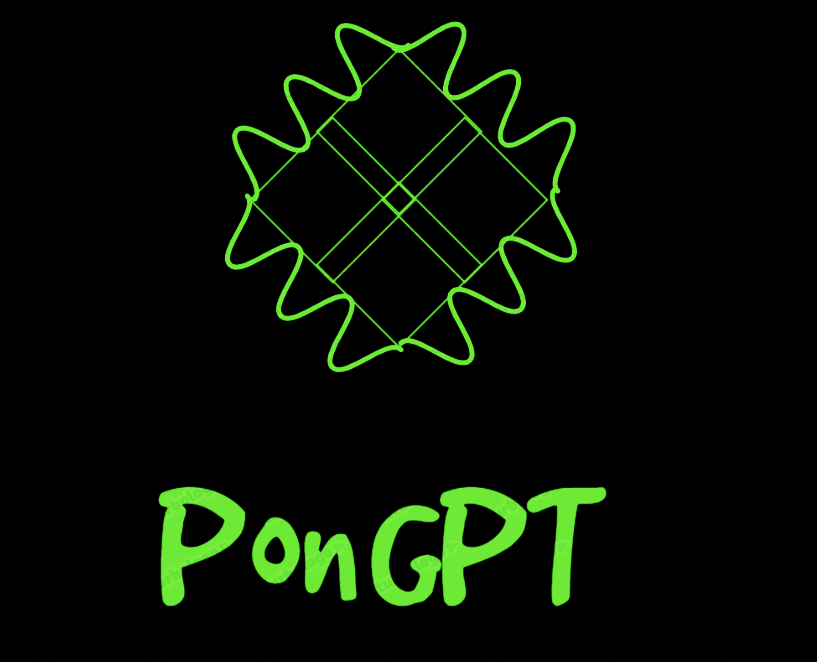
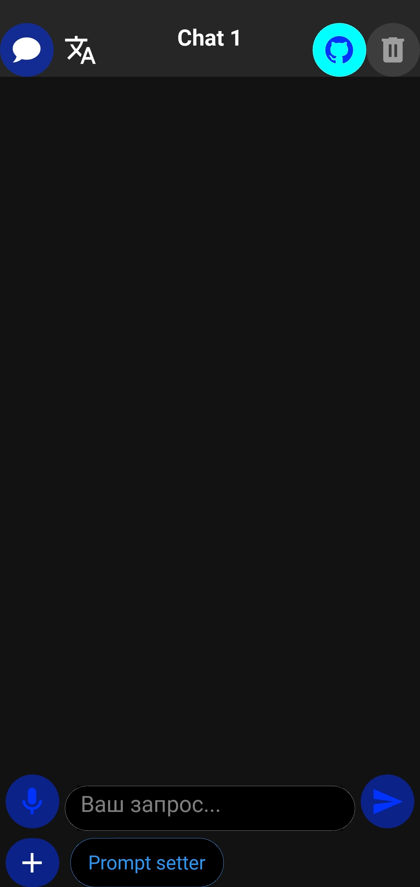
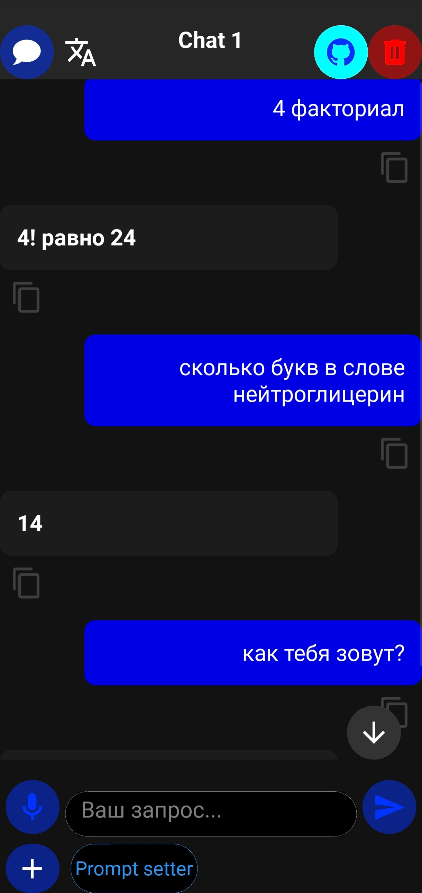
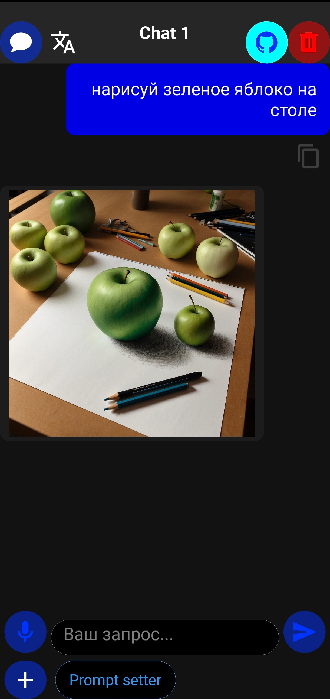
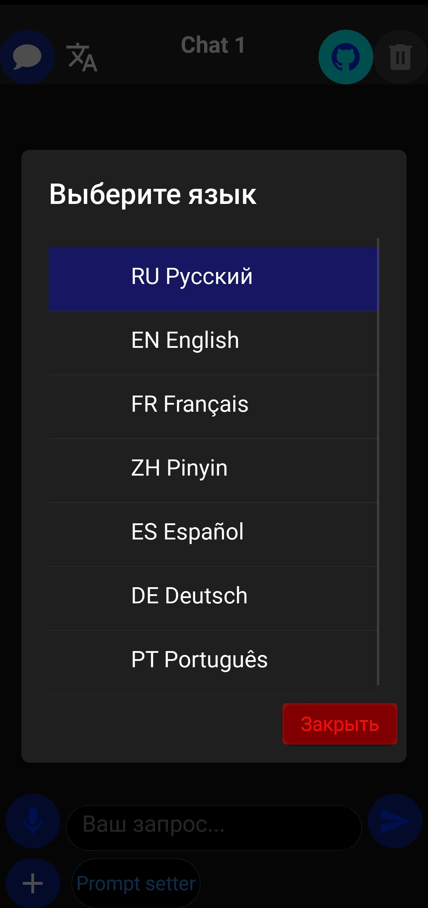

# 🤖 PonGPT — твой личный ИИ-помощник

**PonGPT** — это компактное, но мощное приложение-ассистент на базе ИИ. Оно работает на устройствах Android и предоставляет доступ к современным языковым моделям прямо с твоего телефона.

---

## ✨ Возможности

- 🧠 **Умный чат с ИИ** — общайся с нейросетью на естественном языке
- 🎙️ **Голосовой ввод** — задавай вопросы голосом, получай ответы текстом
- 🖼️ **Генерация изображений** — создавай картинки по текстовому запросу
- 📷 **Распознавание текста с фото** — просто сфотографируй текст, и ИИ его обработает
- 📂 **История чатов** — все диалоги сохраняются, можно переключаться между ними
- 🗣️ **Мультиязычный интерфейс** — поддерживается 7 языков
- 💬 **Подсветка кода** — ответы с кодом отображаются красиво и читаемо
- 🔒 **Конфиденциальность** — данные хранятся локально на устройстве

---

## 📸 Скриншоты

| Главный экран | Чат с ИИ |
|---------------|----------|
|  |  | 

| Генерация изображений| Настройки |
|------------------------|----------------------|
|  |  |

---

## 📥 Скачать

| Платформа | Ссылка |
|-----------|--------|
| **Android APK** | [Скачать последнюю версию](https://github.com/Pidroyder/pon-gpt/releases/latest) |

> ⚠️ **Требования:** Android 7.0 (API 24) и выше.

---

## 🚀 Установка

1. Скачай APK-файл из [Releases](https://github.com/Pidroyder/pon-gpt/releases)
2. Разреши установку из неизвестных источников (Настройки → Безопасность)
3. Открой файл и нажми «Установить»
4. Готово! Наслаждайся общением с ИИ 🤖

По вопросам рекламы: `[pongptofficial@gmail.com]`
[Для рекламодателей](https://github.com/Pidroyder/pon-gpt/blob/main/Для%20Рекламодателей.md)
